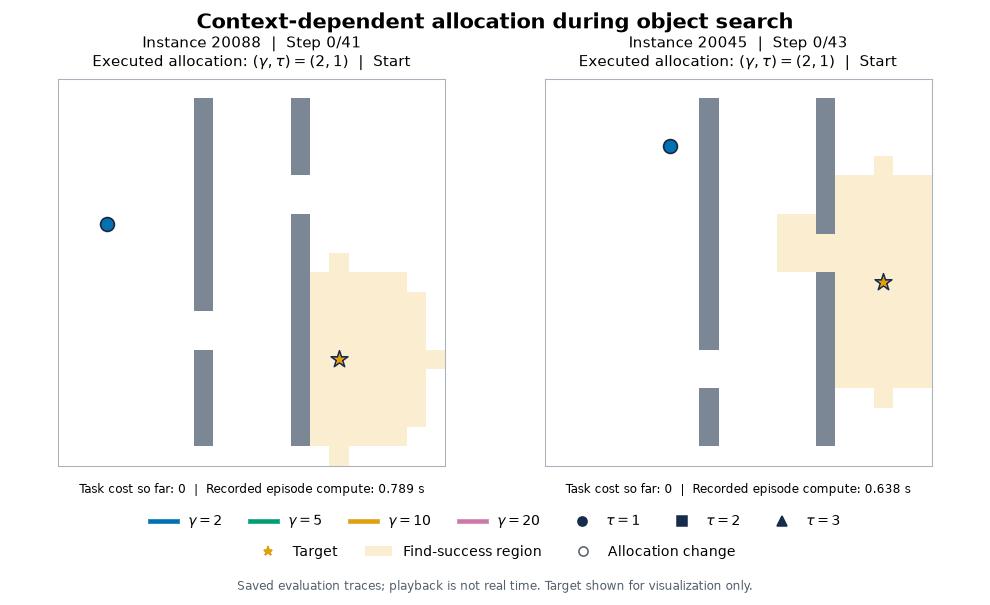

# Active Inference Neural Metacontrol

Learn to adapt belief resolution and planning depth during object search.
This Python toolkit provides neural metacontrol, training and evaluation tools,
and planning baselines for filtered receding-horizon Active Inference in
randomized single-target 2D environments.



Example episodes 20088 and 20045. Path color shows belief resolution
($\gamma$); the robot marker shape shows planning depth ($\tau$). White rings
mark allocation changes. Playback is slowed, and the target is shown only for
visualization. The animation replays saved evaluation traces.

## How it works

The physical workspace is 20 x 20. Target-belief resolution is
`gamma in {2, 5, 10, 20}`; prospective action depth is `T in {1, 2, 3}`.
The agent executes one physical action and reconsiders allocation after every
nonterminal action. Planning depth is not an open-loop commitment length.

Offline, all 12 allocations are evaluated using matched one-step counterfactual
transitions and common observation randomness. Reference-relative fitted
Q-learning estimates downstream operational task return. At runtime, three
independently trained networks supply a conservative relative value: ensemble
mean minus 0.5 times ensemble standard deviation.

The deployed controller minimizes:

```text
predicted task regret
+ computational cost in seconds
+ 0.05 * indicator(allocation changed)
+ 0.8 * normalized Jensen-Shannon belief-transfer loss
```

Computation is immediate inference and policy-evaluation latency, not a learned
trajectory-wide cost. Task return is learned from operational rewards, not
one-step expected free energy. See [method details](docs/method.md).

## Installation

Python 3.11 and Git are recommended. From the repository checkout:

```bash
python -m venv .venv
# Linux/macOS: source .venv/bin/activate
# PowerShell: .\.venv\Scripts\Activate.ps1
python -m pip install -e ".[neural,dev,figures]"
python -m pip install -r requirements-benchmark.txt
```

The pinned navigation dependency supplies MOS; the pinned PyAIF dependency
supplies inference. PyTorch is optional for NumPy-only utilities but required
for training and the learned controller.

## Run a pretrained controller

Three reference checkpoints are included in `artifacts/checkpoints/`.
Load only trusted checkpoints: PyTorch checkpoints contain serialized Python
objects.

```bash
python -m active_inference_neural_metacontrol.meta_q_evaluate_cli --checkpoint artifacts/checkpoints/seed0.pt --ensemble-checkpoints artifacts/checkpoints/seed1.pt artifacts/checkpoints/seed2.pt --instance-seeds 20088 --initial-resolution 2 --initial-depth 1 --max-steps 50 --message-passing-iterations 10 --policy-workers 1 --selection-mode joint --compute-price 0.001 --compute-weight 1 --switch-cost-ms 50 --switching-weight 1 --switch-penalty-mode allocation --information-loss-weight 0.8 --uncertainty-beta 0.5 --torch-threads 1 --output-dir results/example
```

The CLI prices milliseconds; `--compute-price 0.001` corresponds to a coefficient
of 1 per second. The 50-ms switching proxy produces a fixed 0.05-unit penalty;
it is not a measurement of every switch.

See the [training and evaluation guide](docs/reproduction.md) for generation, ensemble
training, the 100-instance benchmark, baselines, ablations, fleet scheduling,
and figures.

## Benchmark results

Evaluation uses seeds 20000-20099 and single-worker profiling. Timing is
hardware-specific, not a latency guarantee.

| Controller | Success (%) | Mean task cost | Mean online computation (ms) |
|---|---:|---:|---:|
| Learned metacontroller | 84 | 49.635 | 669.17 |
| Fixed gamma=10, T=2 | 87 | 45.680 | 1291.02 |
| Fixed gamma=5, T=2 | 75 | 59.165 | 459.41 |
| Entropy heuristic | 67 | 69.485 | 618.65 |
| Fisher/surprise heuristic | 83 | 51.070 | 1086.91 |
| POMCP | 70 | 64.760 | 592.39 |
| 2D multi-resolution POMCP adaptation | 57 | 83.860 | 563.95 |

The learned controller reduces mean computation by 48.2% relative to fixed
gamma=10, T=2. Paired intervals do not establish equal task performance.
MR-POMCP is a primitive-action 2D adaptation, not an exact reproduction of the
original 3D octree planner. Fleet evaluation is trace-driven scheduling of
independent search agents, not cooperative search or physical robots.

## Contents

- `meta_q_data.py`: matched transition generation.
- `meta_regret.py`: reference-relative CNN-MLP training.
- `meta_q_runtime.py`: frozen ensemble and allocation loop.
- `heuristic_runtime.py`, `pomcp.py`, `multi_resolution_pomcp.py`: baselines.
- `fleet_throughput.py`: FCFS shared-worker simulation.
- `artifacts/`: checkpoints, training metadata, reference results and traces.
- `scripts/`: analysis and figure generation.
- `tests/`: unit and integration tests.

Modules reside in `src/active_inference_neural_metacontrol/`. Additional
diagnostic/training tools support alternative training objectives and analysis;
the pretrained controller uses the meta-regret modules documented above.
Large training tensors and generated
runs are not tracked in Git.

## Development

```bash
python -m ruff check .
python -m ruff format --check .
python -m pytest -q
python -m build
```

License: [MIT](LICENSE). Dependencies retain their own licenses.
